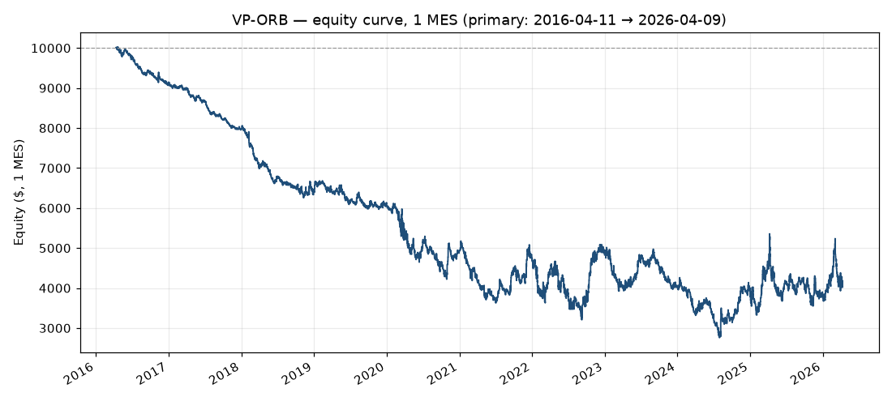

# WIT-0001 — Volume-Profile Opening Range Breakout (VP-ORB)

> **Verdict report.** Source template: [`WIT-T-0001`](../WIT-T-0001-volume-profile-orb-template.md) (Class A, template v1.0). Engine `25.25.0` · dataset `ES_full_5min_continuous_UNadjusted.parquet` · VP source `ES_full_1min_continuous_UNadjusted.txt` · bootstrap seed 42 / 10,000 iterations. Economics: **1 MES, $5/point, $1.25/tick.** We test the strategy as *codified* from the video — not the presenter's live trading.

---

## 1. Headline verdict

### 🔴 Tested — no edge.

Over ~10 years of ES (2016-04-11 → 2026-04-09), the strategy exactly as taught **lost money**: **−$5,976.89** on 1 MES across **2,561 trades**, profit factor **0.90**, win rate **34.3%**, expectancy **−$2.33/trade**. The bootstrap 95% confidence interval for expectancy is **entirely negative** (−$4.73 to −$0.01), and the edge-vs-luck check returns **FAIL**. The result is **robust**: it survives every reasonable interpretation we tested and holds over the full 18-year history (−$14,582). The one bright spot is unrelated to profit — the strategy *is* fast: **median 25 minutes in the market per trade**, comfortably under the "90 minutes a day" claim.

| Metric | Primary run |
|---|---|
| Window | 2016-04-11 → 2026-04-09 (≈10 yr) |
| Trades | 2,561 |
| Net P&L (1 MES) | **−$5,976.89** |
| Profit factor | **0.90** |
| Win rate | 34.3% |
| Expectancy / trade | −$2.33 |
| Max drawdown | −$7,270 (−72.6% of a $10k account) |
| Edge-vs-luck | **FAIL** — expectancy CI entirely negative |
| Median time in market | **25 min/trade** |

**Cost assumptions:** commission $0.62/side, slippage 1 tick/side. Both are disclosed defaults (§4) and sensitivity-tested (§6).

---

## 2. Claimed vs. measured

The signature table: what the video asserted, beside what the data showed. Claims verbatim from [`WIT-T-0001 §A2`](../WIT-T-0001-volume-profile-orb-template.md); the video displayed **zero** supporting statistics (`claims_shown_evidence: false`).

| # | Guru claimed | WIT measured (as codified) | |
|---|---|---|---|
| 1 | *"proven extremely profitable over a 10-year back test"* | −$5,976.89 over ~10 yr; PF 0.90; expectancy CI entirely negative; edge-vs-luck **FAIL** | ❌ **Not supported** |
| 2 | *"consistently gives me wins"* | Win rate 34.3%; losing in 9 of 11 calendar years | ❌ **Not supported** |
| 3 | *"consistent profits in less than 90 minutes per day"* | Time-in-market: **median 25 min**, mean 61 min per trade (max 1 trade/day) | ⏱️ **Time claim TRUE** — but the "profits" half is false (see #1) |
| 4 | *"doesn't matter what market… futures, stocks, crypto, or forex"* | Tested on **ES as proxy** (guru demoed NASDAQ); unprofitable on ES. Market-agnosticism not otherwise testable here | ⚠️ **Proxy-tested; not supported on ES** |
| 5 | *"made over $200,000 in a couple of months"* | Unverifiable personal anecdote — no dataset can confirm it | — **Untestable** |

The honest nuance worth keeping: **claim #3 is partly true.** The method really is quick — a median trade is over in 25 minutes. It just isn't profitable. Fast and wrong is still wrong, but we report the part that held.

---

## 3. Receipts

### Equity curve (1 MES, primary run)

A steady bleed, not a blow-up — consistent with a small negative expectancy paid out ~256 times a year. Full per-trade list (2,561 rows, downloadable): [`data/WIT-0001-primary-trades.csv`](data/WIT-0001-primary-trades.csv).

### Metrics with 95% bootstrap confidence intervals
Percentile bootstrap, 10,000 resamples, seed 42 (the existing validator's settings).

| Metric | Point | 95% CI |
|---|---|---|
| Net P&L | −$5,976.89 | **[−$12,102.02, −$19.33]** |
| Expectancy / trade | −$2.33 | **[−$4.73, −$0.01]** |
| Profit factor | 0.903 | [0.810, 0.9997] |
| Win rate | 34.3% | [32.5%, 36.1%] |

Every interval sits at or below breakeven. The net-P&L and expectancy CIs are **entirely negative** — this is not a case of "positive but not significant"; it is significantly *un*profitable.

### Monte-Carlo edge-vs-luck (backtester validation stack)
**Overall: FAIL.** *"At least one critical check failed. The evidence does not support a reliable edge at this time."*

| Check | Status | Finding |
|---|---|---|
| Edge vs. luck | **fail** | 95% CI for expectancy entirely negative (−$5 to −$0/trade). No positive edge detected. |
| Path risk | info | 46% of trade-order shuffles reached a drawdown ≥ $7,251 (the observed max). |
| Persistence | caution | Only 20% of walk-forward windows were profitable. Edge is inconsistent across time. |
| Signal vs. exposure | inconclusive | Net sits at the 7.7th percentile of random-entry simulations — mid-to-poor, not conclusive. |
| Vs. buy & hold | info | Strategy (−$5,977) trailed buy-and-hold (+$23,865) by $29,842 over the window. |

*(Note per the validator: multiple-testing controls — Deflated Sharpe, PBO — are not yet applied. Here that caveat is moot: the result fails before it ever needs them.)*

### Per-year breakdown (primary)
| Year | Trades | Win rate | Net P&L |
|---|---|---|---|
| 2016¹ | 188 | 29.8% | −$859.37 |
| 2017 | 252 | 33.7% | −$1,167.48 |
| 2018 | 257 | 30.7% | −$1,567.43 |
| 2019 | 257 | 36.2% | −$354.93 |
| 2020 | 256 | 31.2% | −$1,104.94 |
| 2021 | 256 | 36.3% | −$279.94 |
| 2022 | 257 | 37.4% | **+$160.07** |
| 2023 | 255 | 34.9% | −$767.45 |
| 2024 | 258 | 33.3% | −$277.42 |
| 2025 | 257 | 36.6% | −$34.93 |
| 2026¹ | 68 | 41.2% | **+$276.93** |

¹ Partial year (2016 from Apr 11; 2026 to Apr 9). Positive in only 2 of 11 years, both marginal. No regime — trending or choppy — rescues it.

### Exit & direction mix
Exits: **stop 64.4%** (1,650) · target 31.4% (803) · time/force-flat 4.3% (109). Directions: long 1,317 · short 1,245 (roughly balanced — no directional skew driving the loss). With a 2:1 reward:risk you need ~40%+ wins net of costs to profit; 34.3% falls short, and costs widen the gap.

---

## 4. Assumptions & interpretation disclosure

The video left many execution details unstated. Each gap below is a v1 Default Assumption ([WIT-02 §5](../WIT-02-strategy-template-schema.md)), disclosed and — where marked ⚡ — sensitivity-tested in §6. **Six assumptions** were required to make the strategy runnable (the Class A limit):

| Field | Video | Assumption applied |
|---|---|---|
| Position sizing (E1) | unspecified | **1 MES contract**, fixed |
| Time exit (F4) | unspecified | **force-flat at the day's last RTH bar** (handles half-days) |
| Same-bar stop+target (F5) | unspecified | **stop-first** (conservative) ⚡ |
| Re-entry (G1) | unspecified | **none** — max 1 trade/day |
| Short-side stop (F1) | implied | **POC + 2 ticks** (mirror of the long rule) |
| Costs (H1/H2) | never mentioned | **$0.62/side commission**, **1 tick/side slippage** ⚡ |
| Entry trigger (D3) | ambiguous | **close beyond level** (primary) ⚡ vs. whole-body-beyond |

**One measurement note (disclosed):** the 2:1 target is computed from the breakout candle's **close** — the price the strategy acts on — while the engine applies slippage and commission at the actual fill. So the *intended* R:R is exactly 2:1; the *realized* R:R is slightly worse after costs. This is deliberate and realistic, not a bug.

**Volume-profile approximation (B3):** we have no tick data. Each bar's volume is spread uniformly across its high–low span on the 0.25 grid; POC/VAH/VAL come from that. The canonical profile uses **1-minute** bars (≈15 in the 09:30–09:45 window); a **5-minute** profile (3 bars) is tested as a robustness check (§6). The two barely differ, so the approximation is not what sinks the strategy.

---

## 5. Sensitivity — does the verdict survive different readings?

All runs on the primary window. **The "no edge" verdict is robust: it holds under every interpretation.**

| Sweep | Variant | Net P&L | PF | Edge |
|---|---|---|---|---|
| **Entry** | close beyond (primary) | −$5,976.89 | 0.903 | fail |
| | entire body beyond | −$4,217.30 | 0.938 | caution |
| **Slippage** | 0 ticks | **+$425.61** | **1.007** | caution |
| | 1 tick (primary) | −$5,976.89 | 0.903 | fail |
| | 2 ticks | −$12,379.39 | 0.811 | fail |
| **Same-bar** | stop-first (primary) | −$5,976.89 | 0.903 | fail |
| | target-first | −$5,324.39 | 0.913 | caution |
| **VP source** | 1-min (primary) | −$5,976.89 | 0.903 | fail |
| | 5-min | −$5,260.64 | 0.914 | caution |

**Robust / fragile call: ROBUST (no edge).** The result's *sign* flips positive in exactly one cell — **zero slippage** — and even there PF is **1.007**, i.e. statistical breakeven (expectancy ≈ +$0.17/trade, inside the noise). Every realistic reading loses. The 1-min-vs-5-min profile difference is negligible (−$5,977 vs −$5,261), so the tick-data limitation (B3) does not change the verdict. If anything, the strategy's profitability sits *right at the cost line*: it is the spread and commission, not the signal, that decides it — and real trading pays those costs.

---

## 6. Internal-consistency flags (from the video itself)

From [`WIT-T-0001 §A3`](../WIT-T-0001-volume-profile-orb-template.md) — contradictions *inside* the source, independent of our backtest:

1. **Risk/reward arithmetic contradiction.** The video narrates *"a $35 risk to make $620"* while stating a fixed **2:1** rule — under which $35 of risk targets $70, not $620. The number shown cannot come from the strategy as taught. (A second example, "$585 risk to make $1,170," *is* consistent with 2:1.)
2. **"Same time works for any market."** A 9:30 a.m. ET opening range has no meaning for 24-hour markets (crypto, forex), yet the video claims the identical method applies there.

---

## 7. What we could NOT test (from §K)

Explicit and always present. Outside the codified strategy:

- **Live chart-reading coaching** ("watch how the candles print," "this level is powerful — it will be defended") — discretionary, not a rule.
- **The $200,000 anecdote** and all funded-trader / mentorship claims — unverifiable by any dataset.
- **True market-agnosticism** — we tested ES as a disclosed proxy for the demoed NASDAQ; other asset classes are out of v1 scope.
- **Sub-5-minute execution path** — with 5-minute bars, the exact intrabar sequence within the entry and exit bars is modeled by rule (gap-through, then intrabar, then policy), not by tick path. The 1-min-vs-5-min profile check bounds how much this matters here (little).

---

## 8. Data & method disclosure

- **Data end date:** the ES dataset ends **2026-04-09**. The primary window was requested as 2016-04-10 → 2026-04-09; the data's first bar in range is 2016-04-11, so the effective window is **2016-04-11 → 2026-04-09** (≈9.99 years — a fair stand-in for the claimed "10-year backtest"). A **full-history** run (2008-01-02 → 2026-04-09) was executed as a robustness check and is *worse* (−$14,581.93, PF 0.836, win rate 33.7%), confirming the verdict is not an artifact of the chosen window.
- **Boundary artifact:** 2,562 setups produced 2,561 *closed* trades; the final setup (2026-04-09) is still open at the data's last bar and is excluded from closed-trade statistics. Immaterial to the verdict.
- **Reproducibility:** engine `25.25.0`, dataset as named above, VP from 1-minute bars, bootstrap seed 42 / 10,000 iterations, MES economics $5/point. Regenerate with `cd api && python -m wit.analysis`.

---

*We tested the strategy exactly as we understood the rules from the video. Think we got a rule wrong? That's a revision, not an argument — submit the corrected interpretation and we'll re-run it. The verdict is about the codified method on ES, never about anyone's live trading.*
