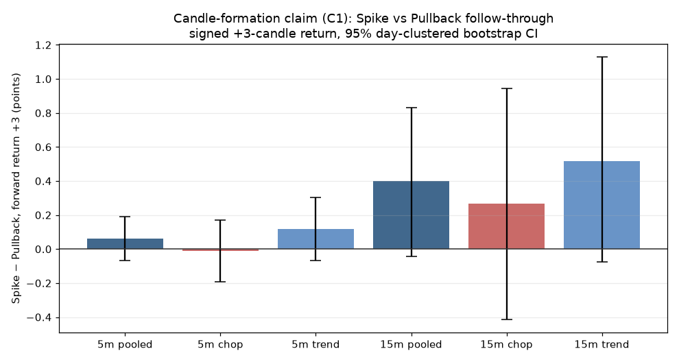

# WIT-0002 — Candlestick Formation Path (CFP)

> **Class B claim report — an event study, not a strategy test.** Source template: [`WIT-T-0002`](../WIT-T-0002-candle-formation-claim-template.md) · transcript: [`WIT-S-0002`](../sources/WIT-S-0002-candle-formation-transcript.md). Engine data: ES 1-minute (RTH), 2016-04-11 → 2026-04-09. Bootstrap seed 42 / 10,000 iterations. **No profitability verdict is produced or implied — see §7.**

---

## 1. What is being tested

The presenter claims that *how a candle forms* — not how it closes — predicts what happens next: a big candle that goes "straight up with no pullbacks" is an **unhealthy spike** likely to reverse/give it back, whereas one that **pulls back intrabar and still closes big** is **healthy** and follows through. He adds that the effect is stronger in a **choppy** market and works on **any timeframe**.

We codified this into three testable claims and ran an event study on **66,355 big 5-minute candles** (and 21,937 15-minute) over ~10 years, reconstructing each candle's intrabar path from its 1-minute sub-bars.

### Headline verdicts

| Claim | Statement | Verdict |
|---|---|---|
| **C1** | Spike candles under-follow-through / give back more than pullback candles | **Not supported** (Inconclusive on forward return; the point estimate leans *slightly opposite*) |
| **C2** | The effect is stronger in chop than in trend | **Inconclusive** (direction is claim-consistent but within noise) |
| **C3** | The effect holds the same on 5-min and 15-min | **Inconclusive** (no established effect to be consistent about) |

**Robustness: the null is robust, not fragile.** Across **all 18** one-variable-at-a-time configurations (thresholds, baselines, regime measures, bucket method, timeframe), C1's forward-return contrast is Inconclusive in every single one, with a stable sign. The claim doesn't fail on a technicality — it simply doesn't show up in the data.

---

## 2. Claimed vs. measured

Claims verbatim from [`WIT-T-0002 §A2`](../WIT-T-0002-candle-formation-claim-template.md); the video showed **no statistics** (`claims_shown_evidence: false`).

| Guru claimed | WIT measured | |
|---|---|---|
| *"A candlestick can… form in a way that shows you it's fake"* — spikes reverse | Spike−Pullback +3-bar forward return **+0.06 pts** (95% CI **−0.07 to +0.19**) — indistinguishable from zero, and the *wrong sign* for the claim | ❌ **Not supported** |
| *"straight up with no pullbacks… likely to give it back"* | Spikes give back **less** than pullbacks, not more (giveback contrast −0.63, CI −0.66 to −0.61) — opposite the claim (measurement caveat in §4) | ❌ **Refuted** on this measure |
| *"a spike… in a choppy environment is more likely to instantly get reversed"* | Chop vs trend difference-in-differences **−0.13 pts** (CI **−0.39 to +0.14**) — direction matches the claim, magnitude within noise | ⚠️ **Inconclusive** |
| *"this can work on a one minute chart, 5 minute… any type of chart"* | Same (positive, claim-opposite) sign on 5-min (+0.06) and 15-min (+0.40); neither significant | ⚠️ **Inconclusive** |
| *"I am up over $4,000"* | Single anecdote — unverifiable | — **Untestable** |
| *"your entries get cleaner, your stops get tighter"* | No rules given → nothing to test | — **Untestable** |

---

## 3. Receipts

### Spike − Pullback follow-through, by regime and timeframe

Every bar's 95% day-clustered CI crosses zero. If the claim were true, the 5-minute bars (especially "chop") would sit clearly **below** zero. They don't.

### C1 — pooled Spike vs Pullback, all horizons (5-min, day-clustered CI)
The claim predicts **negative** contrasts (spikes reverse). Observed:

| Horizon | Spike − Pullback (pts) | 95% CI | 
|---|---|---|
| +1 | +0.014 | [−0.057, +0.085] |
| **+3** | **+0.061** | **[−0.067, +0.189]** |
| +5 | +0.055 | [−0.111, +0.218] |
| +10 | +0.058 | [−0.172, +0.299] |

Not one horizon is negative or significant. Economically the point estimates are ~0.06 points ≈ **$0.30 on 1 MES** — negligible even before they fail significance.

### Per-cell descriptives (bucket × regime, 5-min, primary; mean +3 forward return, iid CI)
| Bucket | Regime | N | Mean fwd +3 (pts) | iid 95% CI | Giveback (×body) |
|---|---|---|---|---|---|
| spike | chop | 15,783 | −0.033 | [−0.138, +0.069] | 0.96 |
| spike | trend | 16,972 | −0.081 | [−0.192, +0.028] | 0.96 |
| pullback | chop | 6,907 | −0.022 | [−0.167, +0.118] | 1.55 |
| pullback | trend | 8,541 | −0.198 | [−0.346, −0.051] | 1.63 |
| middle | chop | 6,797 | −0.022 | [−0.186, +0.145] | 1.18 |
| middle | trend | 7,435 | −0.071 | [−0.223, +0.081] | 1.19 |

*(Per-cell CIs are iid bootstrap, labeled as such; the headline contrasts in §1–3 use the day-clustered bootstrap.)*

**The honest nuance:** *every* bucket has a slightly **negative** mean forward return — after any big candle, price mildly mean-reverts over the next 3 bars, **regardless of how the candle formed**. The formation path (spike vs pullback) does not separate the outcomes. If anything, the one cell that reverts most is **pullback-in-trend** (−0.20) — the candle the guru calls *healthiest*.

### C2 — regime conditioning (5-min)
Spike−Pullback in **chop** = −0.012 (CI −0.19 to +0.17); in **trend** = +0.117 (CI −0.07 to +0.30). Difference-in-differences (chop − trend) = **−0.128 pts** (CI **−0.39 to +0.14**). The *sign* matches the claim (more negative in chop) but the CI comfortably includes zero — **Inconclusive**.

### C3 — timeframe consistency
5-min contrast +0.061, 15-min contrast +0.399 — **same sign** (both positive, i.e. both mildly against the claim), both CIs include zero. There is no significant effect on either timeframe, so "it works on any timeframe" has nothing to be consistent about — **Inconclusive**.

---

## 4. Codification disclosure — every WIT-chosen threshold

The video defines nothing numerically, so WIT chose the codification (WIT-02 §J2). Each choice is disclosed and every one is a **sensitivity row** (§5).

| Concept (guru's words) | WIT codification | Value |
|---|---|---|
| "big candle" | body ≥ k × trailing-median body (same TF, trailing N, causal) | k = **1.5**, N = **20** |
| "straight up, no pullbacks" (spike) | path efficiency ≥ E **and** intrabar counter-retracement ≤ cap (% of body) | E = **0.50**, cap = **20%** |
| "pulls back in the middle and still closes big" (pullback) | intrabar counter-retracement ≥ P (% of body) | P = **40%** |
| neither | "middle" bucket — **reported, not discarded** | — |
| "choppy vs bigger-picture trend" (regime) | Kaufman Efficiency Ratio(20) on prior closes, split at its **trailing median over the prior 390 candles** (rolling, causal — no full-sample statistic in any label) | ER(20), trailing-median |
| "what happens next" | signed forward return at +1/+3/+5/+10; giveback over +1..+3; P(next closes against) | headline = +3 |

**Two disclosures that matter:**
1. **Counter-retracement is measured as % of body, not absolute ticks.** A 15-minute candle's path naturally wiggles ~4× more than a 5-minute one (median intrabar retrace 8 vs 2 ticks); an absolute-tick spike rule starves the 15-min spike bucket (recon found 66 spikes vs thousands). Percent-of-body is scale-free — the only way to compare 5-min and 15-min fairly (which C3 *requires*).
2. **The giveback measure is partly entangled with the bucket definition.** "Giveback" normalizes the post-event adverse move by the candle body; pullback candles spend some range on their intrabar retrace, so their net body can be smaller and their normalized giveback larger. That plausibly inflates the pullback giveback. So we treat **forward return** (clean, unentangled) as the primary C1 evidence and giveback as corroborating-with-caveat. Both point the same way: **no support for "spikes give it back."**

---

## 5. Sensitivity — is the null robust or fragile?

**Protocol (A4):** vary **one** dimension at a time off the primary config — **18 runs total** (no full cross-product). C1's forward-return contrast (spike − pullback, +3 bars):

| Dimension | Variant | Contrast (pts) | Verdict |
|---|---|---|---|
| — | **primary** | +0.061 | Inconclusive |
| big-candle k | 1.25 / 2.0 / **3.0** | +0.059 / +0.101 / +0.018 | Inconclusive ×3 |
| baseline N | 10 / 40 | +0.025 / +0.128 | Inconclusive ×2 |
| spike efficiency E | 0.40 / 0.60 | +0.061 / +0.059 | Inconclusive ×2 |
| spike giveback cap | 15% / 25% | +0.059 / +0.070 | Inconclusive ×2 |
| pullback P | 33% / 50% | +0.065 / +0.033 | Inconclusive ×2 |
| regime measure | in-sample median / fixed ER 0.30 / ADX>20 | +0.061 ×3 | Inconclusive ×3 |
| regime lookback M | 40 | +0.061 | Inconclusive |
| bucket method | percentile (quartiles, in-sample) | +0.035 | Inconclusive |
| timeframe | 15-min | +0.399 | Inconclusive |

**Robust null:** 18/18 Inconclusive, **0 Supported, 0 Refuted**, sign stable (positive — mildly against the claim) in every run. The claim is not "supported under one reading and not another" (which would be *fragile*); it is **consistently unsupported**. That is a strong, if unglamorous, result.

---

## 6. Statistics

- **Headline contrasts** (C1, C2, C3, the DiD): **day-clustered percentile bootstrap** — resample trading days with replacement (10,000 iterations, seed 42), recompute the Spike−Pullback mean difference. Day-clustering respects intraday correlation (many events share a day), giving honestly wider CIs than treating events as independent.
- **Per-cell descriptive CIs:** iid bootstrap via the existing `run_bootstrap` stack (seed 42, 10k), explicitly labeled iid.
- **No new statistics were written** — the day-clustered resampler reuses the stack's percentile-CI machinery and conventions.
- Sample counts are shown in every cell. All 36 primary cells (bucket × regime × k) exceed 300 events (min 1,718 in recon); "Inconclusive" is a first-class result, not a hidden failure.

---

## 7. What this report does NOT say

**This is a Class B claim study. It renders no profitability verdict — no profit factor, net P&L, drawdown, or win rate — and none is implied.**

- **A supported claim would not be a profitable strategy,** and this **unsupported** claim **does not make the presenter's trading bad.** He may read live context, structure, and confluence in ways no candle-path statistic captures. We tested one *codified, mechanical* reading of his words about candle formation — nothing more.
- **Untestable remainder (§K):** the discretionary system around the claim — head-and-shoulders reads, "areas that make sense," double-top/second-attempt sequencing, "wait for the break of this low," the $4,000 winning-trade anecdote, and the PDF/funnel — is explicitly outside this study and cannot be evaluated from the transcript.
- The finding is specific: **on ES, over 2016–2026, the intrabar formation path of a big candle (spike vs pullback) does not, on its own, separate what the next few candles do — robustly across every threshold we tried.** Big candles mildly mean-revert either way.

---

## 8. Method & reproducibility

- Data: ES 1-minute RTH (09:30–16:00 ET), composed to 5-min (5 sub-bars) and 15-min (15 sub-bars); 1-minute→5-minute aggregation was verified byte-identical to the native 5-minute dataset. Completeness gate: ≥5/5 sub-bars (5-min), ≥13/15 (15-min); short candles dropped. Forward horizons never cross the session close/day boundary.
- ES tested as a **disclosed proxy** for the NASDAQ charts shown (WIT-02 §B1) — the claim asserts market-agnosticism.
- Reproduce: `cd api && python -m wit.event_study_report`. Per-cell results, contrasts, and CIs: [`data/WIT-0002-results.json`](data/WIT-0002-results.json).

---

*We tested one mechanical reading of the candle-formation claim on ES. Think we codified "spike" or "pullback" wrong? That's a revision, not an argument — propose the corrected thresholds and we'll re-run. This report judges a claim, never a person's trading.*
